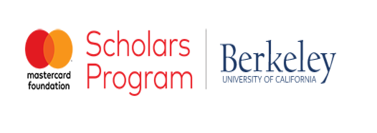

# Data Scientist

#### Technical Skills: Python, R, SQL, AWS, Google Cloud, Econometrics, Tableau and Excel Optimization

## Education
- M.S., Business Analytics | California State Polytechnic University, Pomona, CA (_August 2023_)
- B.A., Political Economics|University of California, Berkeley, CA (_December 2020_)

-   [_Latest Unofficial Transcript_](https://github.com/jolly-io/jolly-io.github.io/blob/7d4c8885e329f363e4739a9c25e960e7910a62b5/Records/Transcript_MastersV1.pdf)

## Industry

**Consulting Analyst @ Accenture Applied Intelligence  (_Sept. 2021 - June 2022_)**
                                                                         
- Accelerated a $15 million cloud supply chain transformation project for a global top 2 cloud provider by 15% through implementation of effective metrics and KPIs benchmarking.
- Enhanced accuracy and completion rates by 25% for a global e-commerce client's urgent data migration to a cloud-based infrastructure through quality control measures, earning managerial recognition.
- Secured a $5 million contract by crafting a customized proposal for an Electric Vehicle manufacturer client's charging location optimization project, resulting in both client and managerial recognition.

##  Research Projects

### Bull and Bear Markets:Asymmetric Volatility Spillover Effects.

In this research, I investigated the Asymmetric Volatility Spillover Effects within and across six major international stock markets indexes namely United States (S&P 500), Canada (TSX 60), France (CAC 40), Germany (DAX 40), Italy (MIB 30) & Japan (NIKKEI 225) on 23 years of time series dataset (1999 - 2022) 

My findings reveal that volatility spillovers are asymmetric, with the largest impact being auto-influence. Canada has the least impact on the other five countries, while Japan and the United States experience the least cross-influence volatility from abroad (most resilient). Italy is most impacted by external volatility changes. In order to realistically and accurately predict volatility, investors' expectations are a significant factor. And contrary to Bensaida (2019), the United States maintains dominance with respect to global market influence.

Find the implementation on my [_Github_](https://github.com/jolly-io/Stock_Markets_Assymetric_Volatility_Spillover_Effects) and Report [_here_](https://github.com/jolly-io/Stock_Markets_Assymetric_Volatility_Spillover_Effects/blob/9692754dd6e52f3ec4e6d06a365f3adce7a08b25/Report_Bull_and_Bear_Market.pdf)                                

### Natural Language Processing (NLP) on Microsoft Azure Reviews

In this project, I leveraged the Latent Dirichlet Allocation (LDA) Topic Modeling technique to implement trends analysis on the textual data aggregated from a high impact reviews platform, capterra.com to uncover key trends and insights that can drive customer satisfaction and inform business growth strategies.

In NLP, LDA is employed to understand the main topics in large volumes of text, making it easier to detect patterns, themes and categorize documents based on their content. Given a set of documents, LDA tries to determine the mix of topics that each document represents and the mix of words that define each topic. LDA is a powerful tool in the NLP toolkit for uncovering the hidden thematic structure in a large collection of textual data, which can be impractical to manually analyze for many organizations but bears invaluable insights that inform products innovations, revenue and business growth.

Learn more about this implementation on my [_Github_](https://github.com/jolly-io/Azure_Reviews_A_Latent_Dirichlet_Allocation_Approach) and the [_Report_](https://github.com/jolly-io/Azure_Reviews_A_Latent_Dirichlet_Allocation_Approach/blob/9086d65c5c98d94e53d5084a78bb940963559a14/Trends_Analysis_Azure_Cloud_Reviews.pdf)

### Exploratory Data Analysis on United States Domestic Flights

In this project, I undertook Exploratory Data Analysis (EDA). Given the dataset, I formulated and posed specific insight eliciting questions and endeavored to answer these questions from the dataset leveraging the Pandas and Numpy libraries and relevant Visualization toolkits.

View the implementation on my [_Github_](https://github.com/jolly-io/EDA_On_US_Domestic_Flights) and read the written [_Report_](https://github.com/jolly-io/EDA_On_US_Domestic_Flights/blob/06bc7e60ff93ddf16af1961862acdf00c17b55a0/Report_%20Understanding_Airlines_Delays_Jolly_Ogbole.pdf)
 

### Telecommunications: Customer Retention and Churn Prediction

In this project, I built a classification model to predict a customer’s likelihood to churn for ZQ, a telecommunications company. Applying the data mining processes, I make the determination among two models (Logistic Regression and Classification and Regression Trees (CART) which was the more effective model to deploy. On the basis of model performance, I proceeded to deploy the Logistic Regression model for the churn classification problem. And conclude with technical and managerial insights for decision makers.

More details on source code implementation [_here_](https://github.com/jolly-io/Modeling_Customer_Churn_Prediction)  and the formal [_Report_](https://github.com/jolly-io/Modeling_Customer_Churn_Prediction/blob/46c503712c7e01e8757974bf113566e81898bc3e/Report_Churn_Prediction_Model.pdf)

## Leadership 
**Strategy Lead @ Mastercard Foundation Scholars Program Initiative, UC Berkeley (_May 2019 - Sept. 2021_)**

- [Raised](https://github.com/jolly-io/jolly-io.github.io/blob/101d02519cf2a442eb03b8377e8ca7711b83b6b2/Records/2021%20EDUSA%20NEWSLETTER.pdf) $2,500 in opportunity funds to sponsor college prep and application costs for over a dozen High School graduates; enabling successful participation in the U.S State Department’s EducationUSA program in Abuja, Nigeria in Summer 2019, resulting in eventual acquisition of full tuition, room and board scholarships to Colleges in the United States and Africa in excess of $1 million in awards in 2020. 
- Raised $3,000 in opportunity funds to sponsor college prep and application costs for about 2 dozen undergraduate and graduate candidates in the U.S State Department’s EducationUSA program in Abuja, Nigeria in Summer 2021, culminating in holistic college scholarships awards in excess of $1 million in total awards money in 2022.

## Awards
- Recipient of the prestigious Mastercard Foundation Scholarship at the University of California, Berkeley in 2016.

